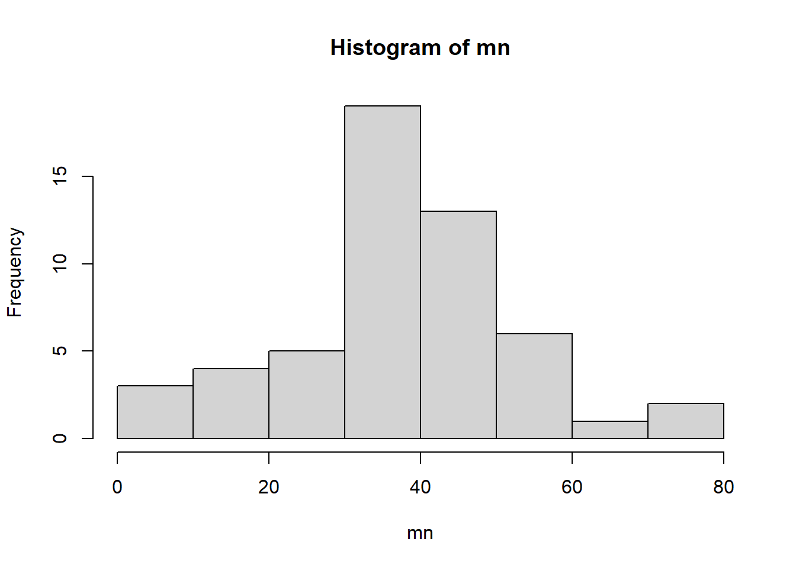
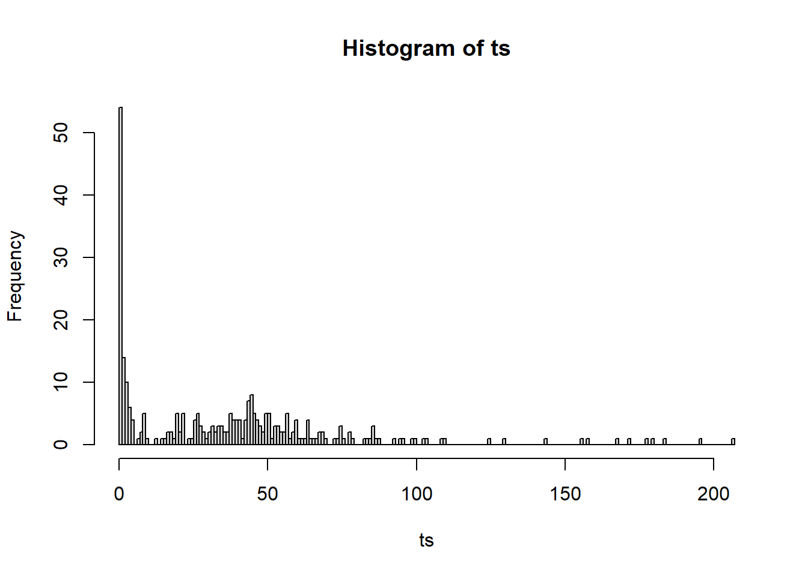
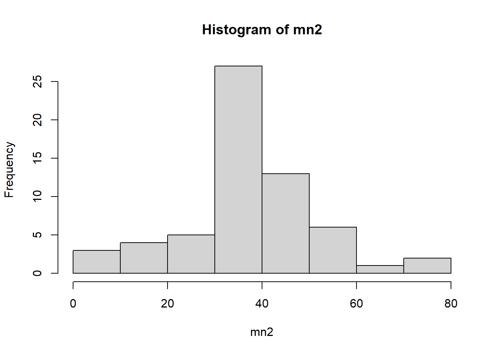
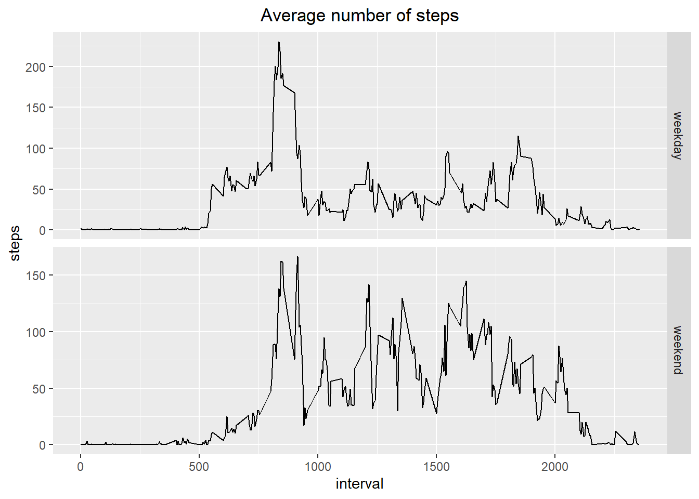

## Loading the data and packages


```r
library(dplyr)
library(ggplot2)
library(lubridate)
data <- read.csv("./activity.csv")
data <- tbl_df(data)
```

## What is mean total number of steps taken per day?

Plot the mean number of steps per day. Below you find the means and medians per day. Note that for most of the days median equals 0. This means that during most of the intervals no steps were taken.


```r
mn <- tapply(data$steps, data$date, mean)
md <- tapply(data$steps, data$date, median) 
hist(mn)
```



```r
mn
```

```
## 2012-10-01 2012-10-02 2012-10-03 2012-10-04 2012-10-05 2012-10-06 2012-10-07 2012-10-08 2012-10-09 2012-10-10 2012-10-11 2012-10-12 
##         NA  0.4375000 39.4166667 42.0694444 46.1597222 53.5416667 38.2465278         NA 44.4826389 34.3750000 35.7777778 60.3541667 
## 2012-10-13 2012-10-14 2012-10-15 2012-10-16 2012-10-17 2012-10-18 2012-10-19 2012-10-20 2012-10-21 2012-10-22 2012-10-23 2012-10-24 
## 43.1458333 52.4236111 35.2048611 52.3750000 46.7083333 34.9166667 41.0729167 36.0937500 30.6284722 46.7361111 30.9652778 29.0104167 
## 2012-10-25 2012-10-26 2012-10-27 2012-10-28 2012-10-29 2012-10-30 2012-10-31 2012-11-01 2012-11-02 2012-11-03 2012-11-04 2012-11-05 
##  8.6527778 23.5347222 35.1354167 39.7847222 17.4236111 34.0937500 53.5208333         NA 36.8055556 36.7048611         NA 36.2465278 
## 2012-11-06 2012-11-07 2012-11-08 2012-11-09 2012-11-10 2012-11-11 2012-11-12 2012-11-13 2012-11-14 2012-11-15 2012-11-16 2012-11-17 
## 28.9375000 44.7326389 11.1770833         NA         NA 43.7777778 37.3784722 25.4722222         NA  0.1423611 18.8923611 49.7881944 
## 2012-11-18 2012-11-19 2012-11-20 2012-11-21 2012-11-22 2012-11-23 2012-11-24 2012-11-25 2012-11-26 2012-11-27 2012-11-28 2012-11-29 
## 52.4652778 30.6979167 15.5277778 44.3993056 70.9270833 73.5902778 50.2708333 41.0902778 38.7569444 47.3819444 35.3576389 24.4687500 
## 2012-11-30 
##         NA
```

```r
md
```

```
## 2012-10-01 2012-10-02 2012-10-03 2012-10-04 2012-10-05 2012-10-06 2012-10-07 2012-10-08 2012-10-09 2012-10-10 2012-10-11 2012-10-12 
##         NA          0          0          0          0          0          0         NA          0          0          0          0 
## 2012-10-13 2012-10-14 2012-10-15 2012-10-16 2012-10-17 2012-10-18 2012-10-19 2012-10-20 2012-10-21 2012-10-22 2012-10-23 2012-10-24 
##          0          0          0          0          0          0          0          0          0          0          0          0 
## 2012-10-25 2012-10-26 2012-10-27 2012-10-28 2012-10-29 2012-10-30 2012-10-31 2012-11-01 2012-11-02 2012-11-03 2012-11-04 2012-11-05 
##          0          0          0          0          0          0          0         NA          0          0         NA          0 
## 2012-11-06 2012-11-07 2012-11-08 2012-11-09 2012-11-10 2012-11-11 2012-11-12 2012-11-13 2012-11-14 2012-11-15 2012-11-16 2012-11-17 
##          0          0          0         NA         NA          0          0          0         NA          0          0          0 
## 2012-11-18 2012-11-19 2012-11-20 2012-11-21 2012-11-22 2012-11-23 2012-11-24 2012-11-25 2012-11-26 2012-11-27 2012-11-28 2012-11-29 
##          0          0          0          0          0          0          0          0          0          0          0          0 
## 2012-11-30 
##         NA
```

## What is the average daily activity pattern?


```r
ts <- tapply(data$steps, data$interval, mean, na.rm = TRUE)
length(unique(data$interval))   # use length function to find the number of intervals (breaks/bins)  
```

```
## [1] 288
```

```r
hist(ts,  breaks = 288)
```



## Imputing missing values
Replace missing values by mean of the interval that missing value belongs to. Plot a histogram showing the mean number of steps in absence of missing values. Show the mean and median.

```r
nas <- is.na(data$steps)
length(data$steps[nas])   # # use length function to find the number of missing values in the steps column 
```

```
## [1] 2304
```

```r
data2 <- data %>% group_by(interval) %>% mutate(steps = ifelse(is.na(steps), mean(steps, na.rm = TRUE), steps))     
mn2 <- tapply(data2$steps, data2$date, mean)
md2 <- tapply(data2$steps, data2$date, median)
hist(mn2)
```



```r
mn
```

```
## 2012-10-01 2012-10-02 2012-10-03 2012-10-04 2012-10-05 2012-10-06 2012-10-07 2012-10-08 2012-10-09 2012-10-10 2012-10-11 2012-10-12 
##         NA  0.4375000 39.4166667 42.0694444 46.1597222 53.5416667 38.2465278         NA 44.4826389 34.3750000 35.7777778 60.3541667 
## 2012-10-13 2012-10-14 2012-10-15 2012-10-16 2012-10-17 2012-10-18 2012-10-19 2012-10-20 2012-10-21 2012-10-22 2012-10-23 2012-10-24 
## 43.1458333 52.4236111 35.2048611 52.3750000 46.7083333 34.9166667 41.0729167 36.0937500 30.6284722 46.7361111 30.9652778 29.0104167 
## 2012-10-25 2012-10-26 2012-10-27 2012-10-28 2012-10-29 2012-10-30 2012-10-31 2012-11-01 2012-11-02 2012-11-03 2012-11-04 2012-11-05 
##  8.6527778 23.5347222 35.1354167 39.7847222 17.4236111 34.0937500 53.5208333         NA 36.8055556 36.7048611         NA 36.2465278 
## 2012-11-06 2012-11-07 2012-11-08 2012-11-09 2012-11-10 2012-11-11 2012-11-12 2012-11-13 2012-11-14 2012-11-15 2012-11-16 2012-11-17 
## 28.9375000 44.7326389 11.1770833         NA         NA 43.7777778 37.3784722 25.4722222         NA  0.1423611 18.8923611 49.7881944 
## 2012-11-18 2012-11-19 2012-11-20 2012-11-21 2012-11-22 2012-11-23 2012-11-24 2012-11-25 2012-11-26 2012-11-27 2012-11-28 2012-11-29 
## 52.4652778 30.6979167 15.5277778 44.3993056 70.9270833 73.5902778 50.2708333 41.0902778 38.7569444 47.3819444 35.3576389 24.4687500 
## 2012-11-30 
##         NA
```

In contrast to most of the dates the imputed dates have a median other than 0. This is because 288 NAs were replaced by the average value for each of the intervals.

```r
md2
```

```
## 2012-10-01 2012-10-02 2012-10-03 2012-10-04 2012-10-05 2012-10-06 2012-10-07 2012-10-08 2012-10-09 2012-10-10 2012-10-11 2012-10-12 
##   34.11321    0.00000    0.00000    0.00000    0.00000    0.00000    0.00000   34.11321    0.00000    0.00000    0.00000    0.00000 
## 2012-10-13 2012-10-14 2012-10-15 2012-10-16 2012-10-17 2012-10-18 2012-10-19 2012-10-20 2012-10-21 2012-10-22 2012-10-23 2012-10-24 
##    0.00000    0.00000    0.00000    0.00000    0.00000    0.00000    0.00000    0.00000    0.00000    0.00000    0.00000    0.00000 
## 2012-10-25 2012-10-26 2012-10-27 2012-10-28 2012-10-29 2012-10-30 2012-10-31 2012-11-01 2012-11-02 2012-11-03 2012-11-04 2012-11-05 
##    0.00000    0.00000    0.00000    0.00000    0.00000    0.00000    0.00000   34.11321    0.00000    0.00000   34.11321    0.00000 
## 2012-11-06 2012-11-07 2012-11-08 2012-11-09 2012-11-10 2012-11-11 2012-11-12 2012-11-13 2012-11-14 2012-11-15 2012-11-16 2012-11-17 
##    0.00000    0.00000    0.00000   34.11321   34.11321    0.00000    0.00000    0.00000   34.11321    0.00000    0.00000    0.00000 
## 2012-11-18 2012-11-19 2012-11-20 2012-11-21 2012-11-22 2012-11-23 2012-11-24 2012-11-25 2012-11-26 2012-11-27 2012-11-28 2012-11-29 
##    0.00000    0.00000    0.00000    0.00000    0.00000    0.00000    0.00000    0.00000    0.00000    0.00000    0.00000    0.00000 
## 2012-11-30 
##   34.11321
```

## Are there differences in activity patterns between weekdays and weekends?

Convert date column to class "Date" and create a two factor variable. Replace missing values by mean of the interval that missing value belongs to. Plot the mean of steps per interval for weekdays and weekend.

```r
data$date <- ymd(data$date)   #use lubridate package to convert to class "Date".
# class(data$date)
# weekdays(data$date)
data$days <- ifelse(weekdays(data$date) %in% c("Saturday", "Sunday"), "weekend", "weekday")
data2 <- data %>% group_by(interval) %>% mutate(steps = ifelse(is.na(steps), mean(steps, na.rm = TRUE), steps))   
g <- ggplot(data2, aes(interval, steps))
g + stat_summary(fun = "mean", geom = "line") + facet_grid(days ~ ., , scales = "free") + ggtitle("Average number of steps") + theme(plot.title = element_text(hjust = 0.5)) 
```


